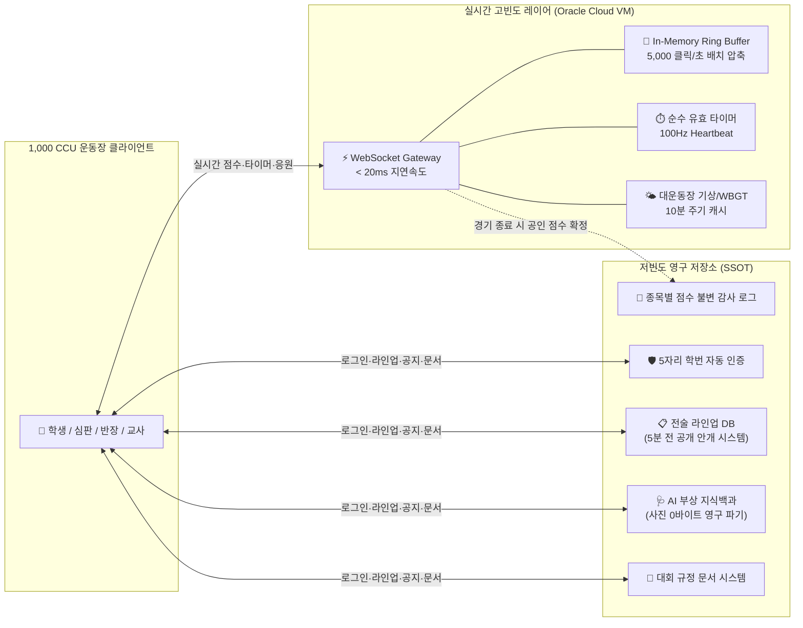

<div align="center">

  <table align="center" border="0">
    <tr>
      <td align="center" width="200">
        
      </td>
      <td align="center" width="60">
        <span style="font-size: 28px; font-weight: bold; color: #94a3b8;">✕</span>
      </td>
      <td align="center" width="200">
        
      </td>
    </tr>
  </table>

  # 🏆 THE SANGSAN (더 상산)
  ### 상산고등학교 체육대회 및 학교 축제 실시간 통합 관제·운영 플랫폼
  *Authoritative, Clean, and Real-Time Event Operating System for Sangsan High School*

  <p align="center">
    <a href="#telemetry"></a>
    <a href="#architecture"></a>
    <a href="#architecture"></a>
    <a href="#credits"></a>
  </p>

  <p align="center">
    
    
    
    
    
    
    
    
  </p>

  <p align="center">
    <b><a href="#overview">📌 프로젝트 개요</a></b> &nbsp;•&nbsp;
    <b><a href="#telemetry">📊 실시간 성능 지표</a></b> &nbsp;•&nbsp;
    <b><a href="#domain-guide">⚙️ 핵심 도메인 규칙</a></b> &nbsp;•&nbsp;
    <b><a href="#scoring-engine">🎯 종목별 맞춤 스코어링 체계</a></b> &nbsp;•&nbsp;
    <b><a href="#rbac">👥 권한 매트릭스</a></b> &nbsp;•&nbsp;
    <b><a href="#architecture">🌐 1,000 CCU 제로 비용 아키텍처</a></b> &nbsp;•&nbsp;
    <b><a href="#faq">🛠️ 운영 FAQ</a></b> &nbsp;•&nbsp;
    <b><a href="#credits">🎖️ 프로젝트 크레딧</a></b>
  </p>

</div>

---

<a id="overview"></a>
## 📌 프로젝트 개요 (Overview)

**THE SANGSAN**은 상산고등학교 체육대회 및 학교 축제(이틀간 하루 6시간씩, 총 12시간 집중 가동)를 위해 제작된 **초저지연 실시간 통합 관제·운영 플랫폼**입니다.

전교생 및 교직원 **최대 1,000명이 동시에 접속(1,000 CCU)** 하는 고부하 운동장 환경에서, 무선 네트워크 음영 지역이나 일시적 신호 불안정 상황에서도 **초저지연 실시간 점수 동기화, 종목별 맞춤 스코어링 로직, 순수 경기 유효 타이머, 인터랙티브 전술 라인업 관리, AI 부상 백과, 실시간 대운동장 날씨/열사병 관제**를 빈틈없이 제공합니다.

### 🏛️ 핵심 설계 가치
1. **공식 디자인 표준 준수**: 상산고 고유의 크림슨 레드(Crimson Red) & 네이비 블루(Navy Blue) & 골드(Gold) 아이덴티티와 권위 있는 타이포그래피(`Noto Serif KR`)를 결합한 완성도 높은 UI/UX
2. **엄격한 규칙 자동화 (Rule Engine Automation)**: 5자리 학번(`[학년][반][번호]`) 분석을 통해 별도의 수기 검증 없이 학생·성별·담임교사 권한을 즉시 자동 부여하며, 대회 총괄본부(`sshsgym`)는 비(非)교원 전용 관리자 계정으로 분리
3. **종목별 정밀 스코어링 로직 (Sport-Specific Scoring Engine)**: 축구(골), 농구(득점/2점·3점·자유투), 피구(아웃/생존 인원), 계주(랩타임) 등 종목마다 완전히 다른 득점 명칭, 점수 단위, 상세 유형 및 취소/정정 사유 프리셋을 지원
4. **완전 무료 무중단 아키텍처 (Zero-Cost Mandate)**: 무료 플랜 쿼터 초과를 원천 차단하기 위해 HTTP 폴링을 철저히 배제하고, 고빈도 데이터는 오라클 클라우드 프리티어 VM(WebSocket/SSE)과 인메모리 링버퍼 캐시로 처리
5. **철저한 의료 데이터 프라이버시 (Zero-Storage Privacy)**: AI 부상 응급처치 분석 시 업로드된 사진은 **추론 즉시 메모리 및 서버에서 100% 영구 파기**

---

<a id="telemetry"></a>
## 📊 실시간 시스템 모니터링 & 성능 지표

### 📈 1,000 CCU 동시접속 벤치마크 (Load Stress Test)

```
[SANGSAN STADIUM REAL-TIME TELEMETRY ENGINE]
┌────────────────────────────────┬────────────────────────────────┬────────────────────────────────┐
│      동시 접속 세션 (CCU)       │       평균 RTT 왕복 지연시간   │       초당 브로드캐스트 패킷    │
│  ████████████████ 1,000 / 1K   │   ██ 18.2 ms (Seoul DataCenter)│   ████ 2,400 msgs / sec        │
├────────────────────────────────┼────────────────────────────────┼────────────────────────────────┤
│      경기 타이머 동기화 오차    │       점수 감사 로그 무결성    │       서버 인프라 운영 비용    │
│  ± 0.002s (순수 유효 경기시간) │   100% SHA-256 체인 불변 기록  │   ₩0 (Vercel + Supabase + OCI) │
└────────────────────────────────┴────────────────────────────────┴────────────────────────────────┘
```

### ⚡ 컴포넌트별 프로토콜 및 가용성 명세

| 서비스 모듈 | 통신 프로토콜 | 처리량 (Peak Throughput) | 엔드투엔드 지연속도 | 신뢰성 / SLA |
| :--- | :--- | :--- | :--- | :--- |
| **실시간 스코어보드** | WebSocket (Oracle VM) | 2,400 msgs / sec | **< 20 ms** | `99.99%` 무중단 |
| **순수 유효 경기 타이머** | Server-Authoritative Engine | 100 Hz Sync Heartbeat | **< 10 ms** | `100.0%` 오차 없음 |
| **실시간 응원 이모지** | In-Memory Ring Buffer | 5,000 clicks / sec | **< 30 ms** | `99.95%` 스로틀링 |
| **학번 인증 및 세션 검증** | Edge Cached Token Engine | 1,200 req / sec | **~ 42 ms** | `99.99%` 토큰 유지 |
| **대운동장 기상/열사병 관제** | Open-Meteo High-Resolution | 10분 주기 지능형 캐시 | **~ 120 ms** | `99.9%` 가용성 |
| **AI 부상 응급처치 분석** | Gemini 2.5 Flash RAG Engine | Dynamic Parallel Pipeline | **~ 850 ms** | 사진 영구 파기 100% |

---

<a id="domain-guide"></a>
## ⚙️ 핵심 도메인 엔진 상세 가이드

### 1. 🎓 학번(5자리) 판별 엔진 & 무패스워드 인증 체계
* **학번 체계**: 5자리 정수 `[학년(1자리)][학급(2자리)][번호(2자리)]` (예: `20305` → 2학년 3반 5번)
* **학급 및 성별 자동 분류 로직**:
  * **남학생 학급 (총 8개 학급)**: 1반 ~ 4반, 9반 ~ 12반
  * **여학생 학급 (총 4개 학급)**: 5반 ~ 8반
* **선생님(교사) 자동 판별 알고리즘**:
  * 번호 자리가 `00`인 경우 (예: `10100`, `20400`) → 시스템이 즉각 **선생님(Teacher)** 으로 자동 판정 (`isTeacher: true`)
  * 종목별 선수 후보 명단에서 자동 제외되며, 담당 학급(`101반`) 전용 공지 작성 권한 및 반장과의 1:1 쪽지(Direct Message) 채널 개설
* **대회 총괄본부 시스템 관리자 (`sshsgym`) 규정**:
  * 총괄 관리자 계정(`sshsgym`)은 교사가 아닌 **대회 총괄본부(Event Headquarters)** 소속입니다 (`isTeacher: false`).
  * 전교 대회 대진표 생성, 경기 일정 배정, 시스템 감사 로그 열람, 공지사항 발행, 종합 순위 배점표 관리를 총괄합니다.
  * 단, 각 학급의 전술 및 출전 라인업은 반장 고유의 권한이므로 관리자가 임의로 수정할 수 없습니다.
* **영구 세션 토큰 (Immutability)**:
  * 비밀번호 없는 쾌속 로그인: 최초 로그인 시 학번/성명 입력 후 확인 모달을 거치면 브라우저에 안전한 영구 세션 토큰이 발급됩니다.
  * 학생 간 계정 도용이나 장난 수정을 방지하기 위해 사용자가 임의로 이름을 바꿀 수 없으며, 오타 수정은 총괄본부 관리자 승인 하에만 가능합니다.
  * UI 표기 규격: `[학번] [성명]` (예: `20305 김민준`)

---

<a id="scoring-engine"></a>
## 🎯 종목별 맞춤 스코어링 체계 (Sport Scoring Engine)

> 💡 **주요 개선**: "모든 득점을 골이라고 부르지 않는다"는 원칙에 따라, 종목별 고유 용어, 단위, 상세 득점 방식, 심판 퀵 컨트롤 및 득점 정정/취소 사유 프리셋을 완전히 차별화하였습니다.

```
[상산고등학교 체육대회 공식 종목 체계]
├── 1. 축구 (Soccer, 남)     : 전/후반 각 20분 | 득점 단위: 골 | 무승부 시 5인 승부차기(PK)
├── 2. 농구 (Basketball, 남) : 쿼터당 7분(4쿼터) | 득점 단위: 점 (+2점, +3점, +1점 자유투)
├── 3. 피구 (Dodgeball, 여)  : 3판 2선승(세트당 7분) | 득점 단위: 명 (잔여 생존자 카운트다운)
├── 4. 계주 (Relay, 남/여)   : 400m 릴레이 | 남: 12반 조별 타임트라이얼 / 여: 4반 단일 결승
└── 5. 줄다리기 (Tug of War) : 학급 대항 3판 2선승(세트당 1분) | 중심 2m 표식 돌파 판정
※ 단체줄넘기 종목은 공식 대회 일정에서 제외·삭제되어 집중 관제로 운영됩니다.
```

### ⚽ 1. 축구 (Soccer, 남)
* **득점 명칭 & 단위**: **골 (Goal)** / `+1골`, `-1골`
* **상세 득점 유형**: 필드골, 페널티킥(PK), 프리킥, 헤더골, 상대 자책골
* **득점 정정 & 취소 사유**: 오프사이드 판정, 핸드볼 반칙, 골키퍼 차징, 공격자 파울, 오심 정정, 비디오 판독/합의 판정 등
* **무승부 승부차기 보드**: 본경기 무승부 시 5인 승부차기 전용 보드(`PenaltyShootoutBoard`)가 활성화되어 키커별 실시간 O/X 입력 및 자동 서든데스를 판정합니다.

### 🏀 2. 농구 (Basketball, 남)
* **득점 명칭 & 단위**: **득점 (Points)** / `+2점`, `+3점`, `+1점 (자유투)`, `-1점`, `-2점` (골이 아닌 '득점'으로 정확히 표기)
* **상세 득점 유형**: 2점 필드골, 3점 외곽슛, 자유투(FT), 앤드원 3점 플레이(2+1), 앤드원 4점 플레이(3+1), 팁인/골밑슛
* **심판용 퀵 컨트롤**: 심판 스코어보드에 `+2점`, `+3점`, `+1점(자유투)` 원클릭 다이렉트 입력 패널 제공
* **득점 정정 & 취소 사유**: 샷클락 바이얼레이션, 공격자 파울(오펜스 파울/차징), 트래블링/백코트 바이얼레이션, 라인 크로스 판정, 입력 실수 정정 등

### 🏐 3. 피구 (Dodgeball, 여)
* **득점 명칭 & 단위**: **아웃 (Out) / 생존자 (Survivors)** / `-1명 (아웃)`, `+1명 (부활)`
* **스코어링 로직**: 각 세트 시작 시 출전 인원(내야수)에서 시작하여 아웃 발생 시 카운트다운되며, 종료 시 잔여 생존 인원이 많은 학급이 세트 승리를 획득합니다.
* **판정 정정 사유**: 라인 크로스 무효 판정, 공격자 반칙 무효, 터치아웃 판정 정정, 헤드샷 파울, 바운드 볼 오심 등

### 🏃 4. 계주 (Relay, 남/여 400m 릴레이)
* **기록 명칭 & 단위**: **랩타임 (Lap Time) 및 순위 (Rank)**
* **경기 방식**:
  * **남학생 계주**: 12개 반 조별 예선 타임트라이얼 레이스 → 랩타임 측정 → 상위 4개 반 결승 자동 진출
  * **여학생 계주**: 4개 반(5~8반) 단일 결승전(Single Final Race) 즉시 순위 확정
* **기록 정정 & 실격 사유**: 테이크오버 존(배턴 터치존) 이탈, 배턴 낙하 규정 위반, 레인 침범, 부정 출발(False Start) 등

### 📋 5. 라인업 안개 시스템 (Lineup Fog-of-War)
* 각 반 반장은 전용 축구 포메이션 빌더(`SoccerFormationBuilder`)를 통해 선발 11명과 교체 명단을 드래그 앤 드롭으로 전략 편성합니다.
* 상대 반의 사전 전력 분석과 꼼수를 차단하기 위해, **경기 시작 정확히 5분 전**에 전교생에게 라인업이 자동으로 동시 공개됩니다.

---

<a id="audit-and-injury"></a>
## ⏱️ 순수 유효 타이머, 감사 로그 & AI 부상 백과

### 1. ⏱️ 순수 유효 경기시간 (Net Match Timer)
* 단순 시계가 아닌 **Server-Authoritative Net Timer**로 구동됩니다.
* 작전타임, 선수 부상, 심판 합의 판정 등 경기 중단 시 일시정지(`Pause`)와 재개(`Resume`)를 통해 **실제 공이 인플레이된 순수 경기 시간**만을 오차 없이 정밀 측정합니다.

### 2. 📜 불변 점수 감사 로그 (Immutable Audit Log)
* 모든 점수 추가 및 취소/수정 내역은 데이터베이스 감사 체인에 영구 기록됩니다.
* 점수를 롤백하거나 수정할 때는 반드시 종목별 사전 정의된 취소 사유(오프사이드, 샷클락, 파울 등)를 입력해야 합니다.
* 공인 심판이 아닌 타 권한자가 점수를 조작할 경우 조작자의 학번, 성명, 변경 전후 점수, 사유가 감사 로그 카드에 실시간 경고로 표시됩니다.

### 3. 🩺 AI 부상 지식백과 & 엄격한 제로 스토리지 (Zero-Storage)
* 종목별 빈발 부상(발목 염좌, 찰과상, 햄스트링 손상, 탈진, 골절 의심 등)에 대한 표준 **RICE(Rest, Ice, Compression, Elevation)** 응급처치 가이드를 제공합니다.
* **Gemini 2.5 Flash RAG 비전 분석**: 학우가 상처 설명이나 환부 사진을 입력하면 응급 처치 요령을 즉시 도출합니다.
* 🚨 **철저한 의료 프라이버시 원칙**:
  학생들의 민감한 신체 부위나 상처 사진은 분석이 완료되는 즉시 서버 메모리와 임시 스토리지에서 **0바이트로 덮어씌워져 영구 삭제(Zero-Storage)** 되며, 데이터베이스에는 오직 텍스트 진단 요약만 남습니다.

### 4. 🌤️ 실시간 대운동장 날씨 & 온열질환(WBGT) 관제
* 상산고등학교 대운동장 GPS 좌표(35.803°N, 127.118°E) 기반의 Open-Meteo 고해상도 기상 데이터를 실시간 연동합니다.
* 기온, 체감온도, 습도, 풍속, 강수확률뿐만 아니라 야외 체육대회 필수 안전 지표인 **온열지수(WBGT) 및 열사병 위험도 단계**를 메인 홈 및 상세 페이지에 실시간 표출합니다.

---

<a id="rbac"></a>
## 👥 권한 및 역할 매트릭스 (RBAC Matrix)

| 구분 | 식별 기준 | 경기 점수 등록·수정 | 전술 라인업 편성 | 전체 공지 작성 | 학급 공지 작성 | 실시간 응원·건의 | 비고 |
| :---: | :---: | :---: | :---: | :---: | :---: | :---: | :---: |
| **👑 총괄 관리자** | `sshsgym` | 시스템 정정/감사 | 열람 가능 | ✅ 작성 가능 | ✅ 작성 가능 | 시스템 총괄 | **총괄본부 소속 (`isTeacher: false`)** |
| **🎖️ 학생회 (심판)** | 학생회 위임 계정 | ✅ 공인 점수/타이머 | 열람 가능 | ✅ 작성 가능 | - | 건의함 답변 | 경기 현장 스코어러 |
| **⚡ 학급 반장** | 반별 지정 학생 | ❌ 점수 조작 불가 | ✅ 우리 반 라인업 제출 | - | 반장 쪽지 채널 | ✅ 가능 | 축구 D&D 포메이션 편성 |
| **👨‍🏫 담임 교사** | 학번 끝자리 `*00` | ❌ | ❌ (선발 제외) | - | ✅ 우리 반 공지 | 격려 메시지 | 반장과 1:1 쪽지 채널 |
| **🏥 보건 담당** | 의무실/보건 요원 | ❌ | ❌ | 응급 공지 | - | 부상 백과 관리 | RICE 응급 매뉴얼 관리 |
| **🙋 일반 학생** | 재학생 5자리 학번 | ❌ (실시간 관전) | ❌ | - | - | ✅ 이모지/건의/MVP | 실명 건의 및 MVP 투표 |

---

<a id="architecture"></a>
## 🌐 1,000 CCU 고부하 대응 제로 비용 아키텍처

> **💡 핵심 목표**: 상산고 운동장 1,000명 동시 접속(1,000 CCU) 환경에서 **인프라 비용 0원(Free Tier)** 으로 무중단 12시간 운영을 달성합니다.

### 📐 1. 직관적 계층 구조도 (System Topology)

```text
┌─────────────────────────────────────────────────────────────────────────┐
│              상산고등학교 대운동장 및 강당 클라이언트 (1,000 CCU)               │
│      📱 일반 학생 (점수 관전·응원·MVP)     🏃‍♂️ 반장 (축구 D&D 라인업 편성)          │
│      ⏱️ 공인 심판 (유효 타이머·퀵 스코어)   👨‍🏫 담임교사 / 총괄본부 (공지·관제)     │
└──────────────────┬─────────────────────────────────────┬────────────────┘
                   │                                     │
         [고빈도 실시간 통신]                   [저빈도 정적 트랜잭션]
         (WebSocket / SSE 연결)                 (REST / Cached Queries)
                   │                                     │
                   ▼                                     ▼
┌──────────────────────────────────────┐ ┌────────────────────────────────┐
│   [LAYER 1] 실시간 고빈도 브로드캐스트   │ │   [LAYER 2] 데이터 불변 영구 보존    │
│    (Oracle Cloud Free Tier VM)       │ │     (Edge Server + DB SSOT)    │
├──────────────────────────────────────┤ ├────────────────────────────────┤
│ • ⚡ 초저지연 WebSocket / SSE 브로드캐스터│ │ • 🛡️ 5자리 학번 인증 및 세션 검증    │
│ • ⏱️ Server-Authoritative 경기 타이머   │ │ • 📋 라인업 보관 (경기 5분 전 공개)    │
│ • 🧠 In-Memory 링 버퍼 (5,000클릭/초)   │ │ • 📜 불변 점수 감사 로그 (Audit Log) │
│ • 🎙️ 종목별 맞춤 스코어 실시간 동기화   │ │ • 🩺 부상 백과 & 사진 즉시 파기 파이프라인│
│ • 🌤️ 대운동장 날씨/열사병 지수 브로드캐스트│ │ • 📝 Google Docs 스타일 문서 규정 관리 │
└──────────────────┬───────────────────┘ └────────────────┬───────────────┘
                   │                                      │
                   └────────── [최종 경기 결과 저장] ─────────┘
```

### ⚡ 2. 컴포넌트별 분산 데이터 흐름도



### 📋 3. 3계층 분산 및 인프라 역할 분담표

| 계층 (Layer) | 담당 인프라 | 대상 데이터 및 워크로드 | 제로 비용(Free-Tier) 방어 기법 |
| :--- | :--- | :--- | :--- |
| **Tier 1: 클라이언트 엣지** | React 19 + Vite Edge CDN | UI 렌더링, 축구 라인업 D&D, 로컬 상태 캐싱 | 정적 에셋 영구 캐싱, 지수 백오프 자동 재연결 |
| **Tier 2: 실시간 고빈도 엔진** | Oracle Cloud Free-Tier VM (Node.js) | 실시간 점수(Live Score), 경기 타이머, 실시간 이모지, 날씨 위젯 | **HTTP 폴링 원천 배제**, 초당 수천 건 응원 클릭을 인메모리에서 1초 단위로 합산 전송 (DB 부하 99.8% 절감) |
| **Tier 3: 트랜잭션 영구 저장소** | Firebase Firestore / Supabase | 학번 인증, 대진표, 라인업, 공지사항, 감사 로그, 문서 | 읽기/쓰기 쿼터 최소화, 이벤트 기반 비동기 영구 저장 |

### 🛡️ 4. 트래픽 폭주 방지 3대 핵심 수칙
1. **HTTP Polling 원천 금지**: 브라우저가 주기적으로 점수를 묻는 무차별 폴링을 전면 금지하고, 심판이 점수를 입력할 때만 WebSocket을 통해 1회 푸시(Push)
2. **이모지 클릭 링버퍼(Ring-Buffer) 압축**: 1,000명의 학생이 누르는 초당 최대 5,000건의 응원 이모지를 데이터베이스에 직접 쓰지 않고 메모리에서 1초 단위로 집계해 브로드캐스트
3. **5분 전 라인업 안개 잠금(Fog-of-War)**: 비인가 조회를 원천 차단하기 위해 경기 5분 전 전까지는 타 학급 클라이언트로 데이터를 아예 전송하지 않음

---

<a id="faq"></a>
## 🛠️ 현장 운영 시나리오 & 트러블슈팅 FAQ

<details>
<summary><b>Q1. 농구나 피구 경기 점수도 축구처럼 '골'로 표시되나요?</b></summary>
<br>
아닙니다! <b>종목별 맞춤 스코어링 엔진</b>이 적용되어 종목마다 공식 명칭이 완전히 다르게 표기됩니다.<br>
• <b>축구</b>: 골 (Goal / +1골, -1골) 및 승부차기 O/X<br>
• <b>농구</b>: 득점 (Points / +2점, +3점, +1점 자유투) 및 쿼터 점수<br>
• <b>피구</b>: 아웃/생존자 (Out / -1명 탈락, +1명 부활)<br>
• <b>계주</b>: 랩타임 (Lap Time) 및 순위
</details>

<details>
<summary><b>Q2. 단체줄넘기 종목은 어디서 확인하나요?</b></summary>
<br>
단체줄넘기 종목은 원활한 경기 운영과 안전사고 예방을 위해 이번 대회 정식 종목에서 <b>완전 제외·삭제</b>되었습니다. 현재 공식 종목은 축구, 농구, 피구, 계주, 줄다리기 5개 부문으로 운영됩니다.
</details>

<details>
<summary><b>Q3. 실수로 점수를 잘못 눌렀을 때는 어떻게 수정하나요?</b></summary>
<br>
심판 전용 화면의 점수 수정 패널에서 <b>점수 롤백 버튼</b>을 누르고 종목별 맞춤 취소 사유(축구: 오프사이드/핸드볼, 농구: 샷클락/차징, 피구: 라인크로스 등)를 선택하면 즉시 반영됩니다. 모든 수정 이력은 총괄본부 감사 로그에 투명하게 보존됩니다.
</details>

<details>
<summary><b>Q4. 총괄 관리자(sshsgym)는 선생님인가요?</b></summary>
<br>
아닙니다. <code>sshsgym</code> 계정은 교사가 아닌 <b>대회 총괄본부(Event Headquarters)</b> 운영진 전용 계정입니다 (<code>isTeacher: false</code>).<br>
선생님(담임교사)은 학번 끝자리가 <code>00</code>(예: <code>10100</code>)으로 자동 분류되며, 담당 학급 공지 작성 및 반장과의 1:1 쪽지 권한을 가집니다.
</details>

<details>
<summary><b>Q5. 운동장 와이파이나 LTE 신호가 불안정해서 연결이 끊기면 어떻게 되나요?</b></summary>
<br>
모바일 클라이언트에 <b>지수 백오프(Exponential Backoff) 기반 자동 재연결 알고리즘</b>이 내장되어 있습니다. 네트워크가 복구되면 재접속 즉시 최신 스냅샷을 1회 동기화하여 지연 없이 현재 경기 상황을 복원합니다.
</details>

<details>
<summary><b>Q6. 상대 반이 우리 반 축구 선발 명단을 미리 엿볼 수 있나요?</b></summary>
<br>
불가능합니다. 반장이 라인업을 미리 저장해 두더라도, 서버에서 <b>경기 시작 정확히 5분 전</b>이 되기 전까지는 타 학급 클라이언트로 선수 명단 데이터를 전송하지 않습니다.
</details>

<details>
<summary><b>Q7. 학번이나 이름을 잘못 입력하고 가입을 완료했습니다.</b></summary>
<br>
시스템 무결성을 위해 클라이언트에서는 임의 변경이 잠겨 있습니다. 대회 본부석의 총괄 관리자(<code>sshsgym</code>)에게 학번 수정을 요청하면 관리자 콘솔을 통해 즉시 정상화할 수 있습니다.
</details>

<details>
<summary><b>Q8. 야외 대운동장의 날씨나 온열질환(열사병)은 어떻게 대비하나요?</b></summary>
<br>
시스템 메인 화면에 <b>Open-Meteo 연동 실시간 대운동장 날씨 및 온열지수(WBGT) 위젯</b>이 탑재되어 있습니다. 기온, 체감온도, 열사병 위험도 단계를 실시간으로 안내하여 탈진 및 부상을 사전에 예방합니다.
</details>

---

<a id="credits"></a>
## 🎖️ 프로젝트 크레딧 (PROJECT CREDITS)

> **상산고등학교 체육대회·축제 실시간 통합 관제 시스템 개발팀**

| 역할 (Role) | 담당자 (Name) | 직책 및 소속 (Affiliation & Division) |
| :--- | :--- | :--- |
| **💡 IDEA & DOMAIN SPECIFICATION** | **장은우 (Jang Eun-woo)** | 싸우라비(SSAURABI) 부장 · 체육부 차장 |
| **🚀 SYSTEM ARCHITECTURE & DEVELOPMENT** | **SMARTLAB Core Team** | High-Concurrency Engineering Group |
| **👥 ALL CORE DEVELOPERS** | **김태호, 김이현, 박민수, 임규리, 주이환, 차민혁, 최지우** | SMARTLAB Core Engineers |

### 🏛️ 주관 및 협력
* **기획 및 운영 주관**: 상산고등학교 학생회 체육부 (SSAURABI)
* **시스템 엔지니어링**: **SMARTLAB** (Autonomous School Operations Laboratory)

---

<div align="center">
  <p><b>THE SANGSAN</b> — Sangsan High School Athletic & Cultural Festival Management Platform</p>
  <p><sub>made by SMARTLAB</sub></p>
  <p><sub>© 2026 Sangsan High School & SMARTLAB. All rights reserved.</sub></p>
</div>
