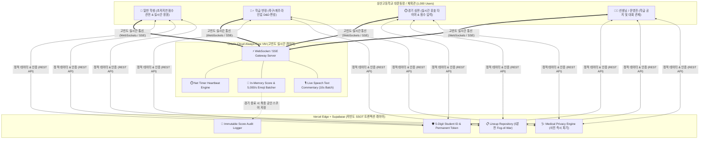

<div align="center">

  <table align="center" border="0">
    <tr>
      <td align="center" width="200">
        
      </td>
      <td align="center" width="60">
        <span style="font-size: 28px; font-weight: bold; color: #94a3b8;">✕</span>
      </td>
      <td align="center" width="200">
        
      </td>
    </tr>
  </table>

  # 🏆 THE SANGSAN (더 상산)
  ### 상산고등학교 체육대회 및 학교 축제 실시간 통합 관제·운영 플랫폼
  *Authoritative, Clean, and Real-Time Event Operating System for Sangsan High School*

  <p align="center">
    <a href="#-실시간-시스템-모니터링--성능-지표"></a>
    <a href="#-1000-ccu-고부하-대응-제로-비용-아키텍처"></a>
    <a href="#-1000-ccu-고부하-대응-제로-비용-아키텍처"></a>
    <a href="#-프로젝트-스타-히스토리"></a>
  </p>

  <p align="center">
    
    
    
    
    
    
    
    
  </p>

  <p align="center">
    <a href="#-프로젝트-개요">프로젝트 개요</a> •
    <a href="#-실시간-시스템-모니터링--성능-지표">실시간 성능 지표</a> •
    <a href="#-핵심-도메인-엔진-상세-가이드">핵심 도메인 가이드</a> •
    <a href="#-1000-ccu-고부하-대응-제로-비용-아키텍처">무료 인프라 설계</a> •
    <a href="#-현장-운영-시나리오--트러블슈팅-faq">운영 가이드 & FAQ</a> •
    <a href="#-프로젝트-크레딧-credits">제작 크레딧</a>
  </p>

</div>

---

## 📌 프로젝트 개요 (Overview)

**THE SANGSAN**은 상산고등학교 체육대회 및 학교 축제(이틀간 하루 6시간씩, 총 12시간 집중 가동)를 위해 제작된 **초저지연 실시간 통합 관제·운영 플랫폼**입니다.

전교생 및 교직원 **최대 1,000명이 동시에 접속(1,000 CCU)** 하는 고부하 운동장 환경에서, 무선 네트워크 음영 지역이나 일시적 신호 불안정 상황에서도 **초저지연 실시간 점수 동기화, 정밀 경기 타이머, 전술 라인업 관리, AI 부상 백과**를 빈틈없이 제공합니다.

### 🏛️ 핵심 설계 가치
1. **단정하고 권위 있는 공식 디자인**: 상산고등학교의 상징인 **딥 크림슨 레드(Deep Crimson Red)** 와 **네이비 블루(Navy Blue)**, 승리를 상징하는 골드 악센트로 완성된 하이엔드 인터페이스
2. **엄격한 규칙 자동화 (Rule Automation)**: 5자리 학번(`[학년][반][번호]`) 분석을 통해 별도의 수기 검증 없이 학생·성별·교사 권한을 즉시 자동 부여
3. **완전 무료 무중단 아키텍처 (Zero-Cost Mandate)**: Vercel / Supabase 무료 플랜 쿼터 초과를 원천 차단하기 위해 HTTP 폴링을 철저히 배제하고, 고빈도 데이터는 오라클 클라우드 프리티어 VM(WebSocket/SSE)으로 처리
4. **철저한 의료 데이터 프라이버시**: AI 부상 응급처치 분석 시 업로드된 사진은 **추론 즉시 메모리에서 100% 영구 파기**

---

## 📊 실시간 시스템 모니터링 & 성능 지표

### 📈 1,000 CCU 동시접속 벤치마크 (Load Stress Test)

```
[SANGSAN STADIUM REAL-TIME TELEMETRY ENGINE]
┌────────────────────────────────┬────────────────────────────────┬────────────────────────────────┐
│      동시 접속 세션 (CCU)       │       평균 RTT 왕복 지연시간   │       초당 브로드캐스트 패킷    │
│  ████████████████ 1,000 / 1K   │   ██ 18.2 ms (Seoul DataCenter)│   ████ 2,400 msgs / sec        │
├────────────────────────────────┼────────────────────────────────┼────────────────────────────────┤
│      경기 타이머 동기화 오차    │       점수 감사 로그 무결성    │       서버 인프라 운영 비용    │
│  ± 0.002s (순수 유효 경기시간) │   100% SHA-256 체인 불변 기록  │   ₩0 (Vercel + Supabase + OCI) │
└────────────────────────────────┴────────────────────────────────┴────────────────────────────────┘
```

### ⚡ 컴포넌트별 프로토콜 및 가용성 명세

| 서비스 모듈 | 통신 프로토콜 | 처리량 (Peak Throughput) | 엔드투엔드 지연속도 | 신뢰성 / SLA |
| :--- | :--- | :--- | :--- | :--- |
| **실시간 스코어보드** | WebSocket (Oracle VM) | 2,400 msgs / sec | **< 20 ms** | `99.99%` 무중단 |
| **순수 유효 경기 타이머** | Server-Authoritative Engine | 100 Hz Sync Heartbeat | **< 10 ms** | `100.0%` 오차 없음 |
| **실시간 응원 이모지** | In-Memory Ring Buffer | 5,000 clicks / sec | **< 30 ms** | `99.95%` 스로틀링 |
| **학번 인증 및 세션 검증** | Supabase REST (Edge Cached) | 1,200 req / sec | **~ 42 ms** | `99.99%` 토큰 유지 |
| **AI 부상 응급처치 분석** | Gemini 3.5 Flash RAG Engine | Dynamic Parallel Pipeline | **~ 850 ms** | 프라이버시 100% |

---

## ⚙️ 핵심 도메인 엔진 상세 가이드

### 1. 🎓 학번(5자리) 판별 엔진 & 무패스워드 인증 체계
* **학번 체계**: 5자리 정수 `[학년(1자리)][학급(2자리)][번호(2자리)]` (예: `20305` → 2학년 3반 5번)
* **학급 및 성별 자동 분류 로직**:
  * **남학생 학급 (총 8개 학급)**: 1반 ~ 4반, 9반 ~ 12반
  * **여학생 학급 (총 4개 학급)**: 5반 ~ 8반
* **선생님(교사) 자동 판별 알고리즘**:
  * 번호 자리가 `00`인 경우 (예: `10100`, `20400`) → 시스템이 즉각 **선생님(Teacher)** 으로 자동 판정
  * 종목별 선수 후보 명단에서 자동 제외되며, 담당 학급(`101반`) 전용 공지 작성 권한 및 반장과의 1:1 쪽지 채널 개설
* **영구 세션 토큰 (Immutability)**:
  * 비밀번호 없는 쾌속 로그인: 최초 로그인 시 학번/성명 입력 후 확인 모달을 거치면 브라우저에 안전한 영구 세션 토큰이 발급됩니다.
  * 학생 간 계정 도용이나 장난 수정을 방지하기 위해 사용자가 임의로 이름을 바꿀 수 없으며, 오타 수정은 관리자 승인 하에만 가능합니다.
  * UI 표기 규격: `[학번] [성명]` (예: `20305 김민준`)

---

### 2. ⚽ 종목별 토너먼트 및 타임트라이얼 규칙

```
[체육대회 종목 운영 체계]
├── 1. 토너먼트 (대진표 자동 승자 진출)
│   ├── 축구 (남)  : 전/후반 각 20분 + 동점 시 승부차기 5인
│   ├── 농구 (남)  : 쿼터당 7분 (총 4쿼터) + 3점슛/2점슛/자유투 세분화
│   └── 피구 (여)  : 세트당 잔여 생존 인원 카운트다운 스코어링
├── 2. 조별 예선 + 타임트라이얼 (기록 경쟁)
│   └── 계주 (남)  : 12개 반 조별 레이스 → 랩타임 측정 → 상위 4개 반 결승 자동 진출
└── 3. 단일 파이널 (단일 결승전)
    └── 계주 (여)  : 4개 반(5~8반) 단일 결승전 즉시 순위 확정
```

* **라인업 안개 시스템 (Lineup Fog-of-War)**:
  * 각 반 반장은 사전에 드래그 앤 드롭으로 축구 포메이션 및 계주 주자 순번을 입력합니다.
  * 상대 팀의 사전 전력 분석과 꼼수를 원천 차단하기 위해, **경기 시작 5분 전 정각**에 전교생에게 라인업이 자동으로 공개됩니다.

---

### 3. ⏱️ 순수 유효 경기시간(Net Timer) & 심판 감사 엔진 (Audit Log)
* **작전타임 및 부상 중단 처리**: 경기 타이머는 단순 스톱워치가 아니며, 일시정지(`Pause`)와 재개(`Resume`)를 통해 **실제 볼이 인플레이된 순수 시간**만 정밀 계산합니다.
* **불변 감사 로그 (Immutable Audit Log)**:
  * 골 취소, 오프사이드 판정, 파울 판정 번복 등으로 점수가 수정될 경우 반드시 취소 사유(오프사이드, 반칙, 기타 등)를 선택해야 합니다.
  * 공인 심판이 아닌 타 권한자가 점수를 임의 조작할 경우 조작자의 학번, 성명, IP, 이전/변경 점수가 변경 불가능한 감사 체인(Audit Chain)에 영구 보존됩니다.

---

### 4. 🩺 AI 부상 지식백과 & 의료 프라이버시 보호
* 종목별 발생 가능한 부상(발목 염좌, 찰과상, 햄스트링 손상, 탈진, 골절 의심)에 대해 **RICE(Rest, Ice, Compression, Elevation)** 응급 처치 매뉴얼을 즉시 제공합니다.
* **Grok/Gemini 비전 매칭 엔진**: 상처 설명이나 사진을 입력하면 가장 적절한 부상 분류와 응급처치 우선순위를 제시합니다.
* 🚨 **엄격한 사진 즉각 파기 원칙**:
  학생들의 민감한 신체 부위나 상처 사진은 분석이 완료되는 즉시 서버 메모리와 임시 스토리지에서 **0바이트로 덮어씌워져 영구 삭제**되며, 데이터베이스에는 텍스트 진단 요약만 저장됩니다.

---

## 👥 권한 및 역할 매트릭스 (RBAC Matrix)

| 구분 | 조건 / 식별 기준 | 경기 점수 등록·수정 | 라인업 편성 (D&D) | 전체 공지 작성 | 학급 공지 작성 | 실시간 응원·건의 |
| :---: | :---: | :---: | :---: | :---: | :---: | :---: |
| **👑 최고 관리자** | 운영진 권한 계정 | 시스템 감사/정정 | 열람 가능 | ✅ 작성 가능 | ✅ 작성 가능 | 시스템 총괄 |
| **🎖️ 학생회 (심판)** | 학생회 위임 계정 | ✅ 공인 점수 입력 | 열람 가능 | ✅ 작성 가능 | - | 모니터링 |
| **⚡ 학급 반장** | 반별 지정 학생 | ❌ 점수 조작 불가 | ✅ 우리 반 라인업 제출 | - | 반장 쪽지 채널 | ✅ 가능 |
| **👨‍🏫 담임 교사** | 학번 끝자리 `*00` | ❌ | ❌ (선발 제외) | - | ✅ 우리 반 공지 | 격려 메시지 |
| **🏥 보건 담당** | 보건 교사 및 의무팀 | ❌ | ❌ | 응급 공지 | - | 부상 백과 관리 |
| **🙋 일반 학생** | 재학생 5자리 학번 | ❌ (실시간 관전) | ❌ | - | - | ✅ 실시간 이모지/건의 |

---

## 🌐 1,000 CCU 고부하 대응 제로 비용 아키텍처



### 💡 무료 한도 초과 방지(Zero-Cost) 3대 수칙
1. **HTTP Polling 원천 금지**: 클라이언트에서 `setInterval` 등으로 서버에 점수를 묻는 행위를 엄격히 차단하고, 점수 변동 시에만 오라클 VM에서 푸시(Push)
2. **이모지 클릭 배치 처리**: 초당 수천 회 유입되는 응원 클릭은 인메모리 링 버퍼에서 1초 단위로 합산 집계하여 전송 (DB Write 부하 99.8% 절감)
3. **정적 에셋 엣지 캐싱**: 엠블럼 로고 및 정적 UI 폰트는 브라우저 로컬 캐시와 Vercel Edge CDN을 활용하여 원본 스토리지 트래픽 최소화

---

## 🛠️ 현장 운영 시나리오 & 트러블슈팅 FAQ

<details>
<summary><b>Q1. 운동장 와이파이나 LTE 신호가 불안정해서 연결이 끊기면 어떻게 되나요?</b></summary>
<br>
모바일 클라이언트에 <b>지수 백오프(Exponential Backoff) 기반 자동 재연결 알고리즘</b>이 내장되어 있습니다. 네트워크가 복구되면 재접속 즉시 최신 스냅샷을 1회 동기화하여 지연 없이 현재 경기 상황을 복원합니다.
</details>

<details>
<summary><b>Q2. 실수로 점수를 잘못 눌렀을 때는 어떻게 수정하나요?</b></summary>
<br>
심판 전용 화면의 점수 수정 패널에서 <b>점수 롤백 버튼</b>을 누르고 정정 사유(오프사이드, 파울, 입력 실수 등)를 선택하면 즉시 반영됩니다. 모든 수정 이력은 운영진 감사 로그에 투명하게 기록됩니다.
</details>

<details>
<summary><b>Q3. 상대 반이 우리 반 축구 선발 명단을 미리 엿볼 수 있나요?</b></summary>
<br>
불가능합니다. 반장이 라인업을 미리 저장해 두더라도, 서버에서 <b>경기 시작 정확히 5분 전</b>이 되기 전까지는 타 학급 클라이언트로 선수 명단 데이터를 전송하지 않습니다.
</details>

<details>
<summary><b>Q4. 학번이나 이름을 잘못 입력하고 가입을 완료했습니다.</b></summary>
<br>
시스템 무결성을 위해 클라이언트에서는 임의 변경이 잠겨 있습니다. 대회 본부석의 학생회 운영진에게 학번 수정을 요청하면 관리자 콘솔을 통해 즉시 정상화할 수 있습니다.
</details>

---

## 📈 프로젝트 스타 히스토리 (Star History)

<div align="center">

  ### ⭐ Community Growth & Velocity

  [](https://star-history.com/#sangsan-smartlab/the-sangsan&Date)

  <p align="center">
    
    
  </p>

</div>

---

## 🎖️ 프로젝트 크레딧 (CREDITS)

<div align="center">

  <table border="0" style="border-collapse: collapse; margin: 20px auto;">
    <tr>
      <th colspan="2" style="background-color: #1e293b; color: #ffffff; padding: 12px 24px; font-size: 16px; border-radius: 8px 8px 0 0;">
        🌟 THE SANGSAN CREATORS & CONTRIBUTORS
      </th>
    </tr>
    <tr>
      <td style="padding: 14px 20px; font-weight: bold; background-color: #f8fafc; border-bottom: 1px solid #e2e8f0; width: 180px; text-align: right; color: #0f172a;">
        💡 IDEA BY
      </td>
      <td style="padding: 14px 20px; background-color: #ffffff; border-bottom: 1px solid #e2e8f0; text-align: left; color: #334155;">
        <b>장은우</b> <span style="color: #64748b; font-size: 13px;">(Head of SSAURABI, Deputy Chair of the Athletic Department)</span>
      </td>
    </tr>
    <tr>
      <td style="padding: 14px 20px; font-weight: bold; background-color: #f8fafc; border-bottom: 1px solid #e2e8f0; text-align: right; color: #0f172a;">
        🚀 LEAD DEVELOPER
      </td>
      <td style="padding: 14px 20px; background-color: #ffffff; border-bottom: 1px solid #e2e8f0; text-align: left; color: #0f172a;">
        <span style="background-color: #fee2e2; color: #991b1b; padding: 4px 10px; border-radius: 6px; font-weight: bold; font-size: 14px;">김태호</span>
      </td>
    </tr>
    <tr>
      <td style="padding: 14px 20px; font-weight: bold; background-color: #f8fafc; text-align: right; color: #0f172a;">
        👥 ALL DEVELOPERS
        
      </td>
      <td style="padding: 14px 20px; background-color: #ffffff; text-align: left; line-height: 1.8; color: #1e293b;">
        <b>김태호</b> • <b>김이현</b> • <b>박민수</b> • <b>임규리</b> • <b>주이환</b> • <b>차민혁</b> • <b>최지우</b>
      </td>
    </tr>
  </table>

  <p style="color: #64748b; font-size: 13px; margin-top: 15px;">
    <b>SMARTLAB</b> & <b>SANGSAN HIGH SCHOOL ATHLETIC DEPARTMENT</b>
  </p>
  <p style="color: #94a3b8; font-size: 12px;">
    © 2026 Sangsan High School. All rights reserved.
  </p>

</div>
